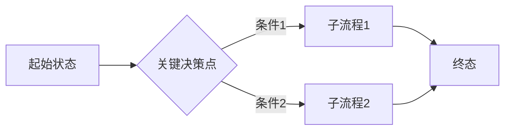
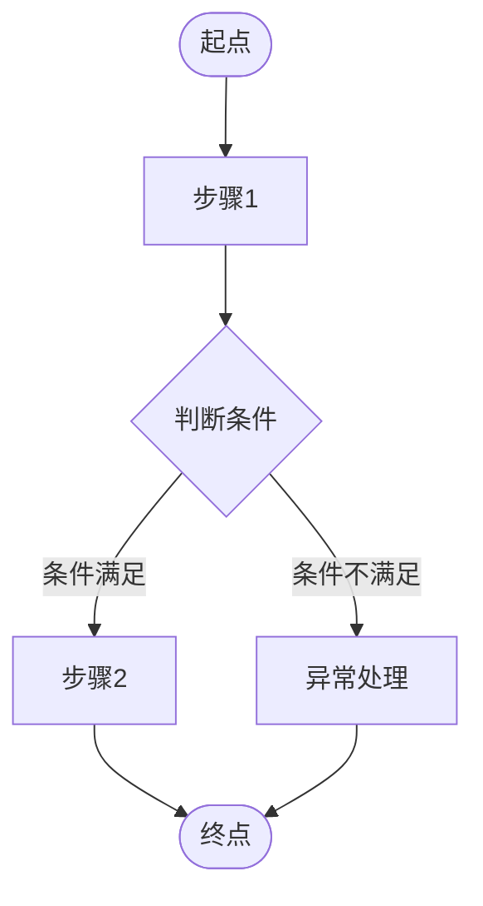
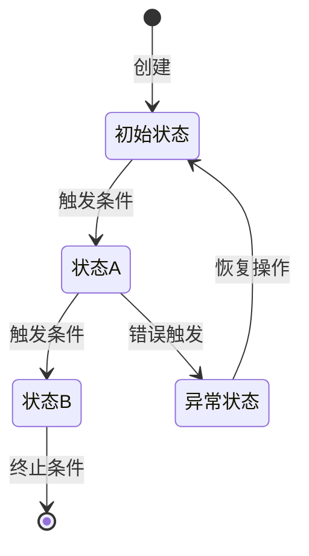

# PRD 模板

```markdown
# 需求文档：[产品/模块名称]

**版本:** v1.0
**状态:** 草稿
**最后更新:** [日期]
**目标受众:** 产品/业务方、架构师智能体 (System Design Agent)、QA 智能体

---

## 元数据

| 字段 | 值 |
|:---|:---|
| 优先级 | 高 / 中 / 低 |
| 目标平台 | Web / 移动端 / 小程序 / 全平台 |
| 核心依赖服务 | [列出依赖的其他服务或模块] |
| 约束条件 | [技术约束、合规约束，明确不做的事] |
| 成功指标 | [可量化的 KPI，如"登录成功率>99.5%"] |

---

## 1. 业务背景与价值 (The "Why")

> 💡 *给 Agent 的上下文：帮助大模型理解商业意图，在设计系统架构时做出正确的折中（偏向高并发？强一致性？低延迟？）。*

- **解决的痛点:** [描述用户当前遇到的具体问题，附数据支撑，如"用户反馈占比45%"]
- **业务价值:** [量化描述，如"提升转化率 20%，降低客服工单成本 30%"]
- **核心场景:** [一段有具体人物和情境的用户故事，展示典型使用路径]

---

## 2. 角色与权限模型 (Roles & Permissions)

> 💡 *给 Agent 的上下文：指导架构师 Agent 设计 RBAC 权限模型和认证中间件。每个角色的数据可见范围直接对应数据库查询的 WHERE 条件。*

| 角色名称 | 核心职责 | 数据可见范围 | 操作权限 |
|:---|:---|:---|:---|
| 匿名访客 (Guest) | [职责] | [数据范围] | [仅允许的操作] |
| 普通用户 (User) | [职责] | [数据范围] | [允许的操作] |
| [其他角色] | ... | ... | ... |

---

## 3. 核心业务流转 (Business Workflows)

> 💡 *给 Agent 的上下文：直接解析以下 Mermaid 图生成状态机设计和 API 调用时序。禁止用图片或纯文字描述替代，所有分支逻辑必须在图中完整体现。*

### 3.1 核心流程总览



### 3.2 [核心子流程名称]



### 3.3 实体状态机



---

## 4. 信息架构与页面映射 (Information Architecture & UI Mapping)

> 💡 *给 Agent 的上下文：PM 使用业务领域实体描述，禁止使用技术字段名（如 user.id）。架构师 Agent 将根据实体定义推导 Database Schema 和 REST API 协议。*

### 4.1 业务领域模型 (Business Entities)

- **实体：[实体名1]**
  - 核心属性：[属性A]、[属性B]、[属性C（附说明）]

- **实体：[实体名2]**
  - 核心属性：[属性A]、[属性B]

### 4.2 页面：[页面名称]

**页面全局状态定义:**

| 状态名 | 触发条件 | 页面表现 |
|:---|:---|:---|
| `初始态 (Default)` | 页面加载完成，数据就绪 | [正常内容展示] |
| `加载态 (Loading)` | 数据请求进行中 | 骨架屏占位，禁用操作按钮 |
| `空态 (Empty)` | 接口返回空数据 | [占位插图 + 引导文案 + 操作按钮] |
| `异常态 (Error)` | 网络超时 / 接口报错 | "稍后重试"提示 + 重试按钮 |
| `成功态 (Success)` | 操作成功完成 | [Toast 提示 / 页面跳转 / 状态更新] |
| `边界态 (Limit)` | [配额/权限/时间等边界触发] | [限制提示 + 引导操作] |

**页面区块与语义数据绑定 (UI Semantic Mapping):**

> 💡 *给全栈 Agent 的上下文：将以下 DOM 区块绑定到业务实体属性。架构师 Agent 据此设计 API Response 字段和前端 State 结构。*

- **区块 A：[区块名称]**
  - [元素名称] → 绑定【实体：X】的【属性：Y】
  - [显示条件]：仅当【实体：X】的【属性：Z】满足 [条件] 时才渲染此元素

- **区块 B：[区块名称]**
  - [元素名称] → 绑定【实体：X】的【属性：Y】
  - 交互规则：[触发条件] → [系统行为]

**交互行为矩阵:**

| 触发元素 | 触发事件 | 前置条件 | 系统响应 |
|:---|:---|:---|:---|
| [按钮/输入框ID] | [点击/失焦/输入第N位] | [条件，无则填"-"] | [具体行为] |

**全局交互状态机 (UI State Machine):**

> 💡 *给架构师 Agent 的上下文：据此设计前端状态管理 (State Management) 和 API 错误码映射逻辑。*

| 触发前置状态 | 触发行为 | 业务流转判断 | 系统下一状态 | 页面交互反馈 |
|:---|:---|:---|:---|:---|
| [当前状态] | [用户操作] | [判断条件] | **[下一状态]** | [UI 反馈描述] |

---

## 5. 核心业务规则决策表 (Business Rules Decision Table)

> 💡 *给 Agent 的上下文：这是生成业务服务层 (Service Layer) 核心逻辑的基础。请穷举所有条件组合，不允许存在未覆盖的条件分支。*

**场景：[规则场景名称，如"运费计算规则"、"权限校验规则"]**

| 条件1：[字段名] | 条件2：[字段名] | 条件N：... | 输出：[结果字段] |
|:---|:---|:---|:---|
| [值] | [值] | [值] | [结果] |
| [值] | [值] | [任意] | [结果] |

---

## 6. 行为边界与验收标准 (Acceptance Criteria - BDD)

> 💡 *给 QA Agent 的上下文：请直接将以下 Gherkin 语法转化为自动化测试脚本。每个场景对应一个独立的测试用例。*

**场景1：[正向场景名称]**
- **Given (假设):** [初始前置状态]
- **And (并且):** [额外的前置条件]
- **When (当):** [用户触发的动作]
- **Then (那么):** [期望的系统行为/结果]
- **And (并且):** [额外的期望结果]

**场景2：[异常场景名称]**
- **Given (假设):** [导致异常的前置条件]
- **When (当):** [用户操作]
- **Then (那么):** [期望的系统降级行为]
- **And (并且):** [提示信息 / 后续状态]

**场景3：[边界场景名称]**
- **Given (假设):** [边界条件]
- **When (当):** [触发动作]
- **Then (那么):** [边界处理结果]

---

## 7. 非功能性与隐性约束 (Non-Functional Constraints)

> 💡 *给 Agent 的上下文：这些约束替代人类工程师的"行业常识"，防止 Agent 生成存在安全漏洞或性能缺陷的架构方案。*

- **数据脱敏：** [哪些字段需要脱敏，如"手机号显示为 138****1234"、"身份证只显示后4位"]
- **性能要求：** [核心接口的延迟目标，如"P95 < 200ms，P99 < 500ms"]
- **并发控制：** [防抖/节流/幂等要求，如"提交按钮必须防抖，阻止重复提交"]
- **安全要求：** [认证方式、敏感操作二次验证、日志记录要求]
- **合规要求：** [数据保留期限、用户授权机制、等保/GDPR 要求]
```
