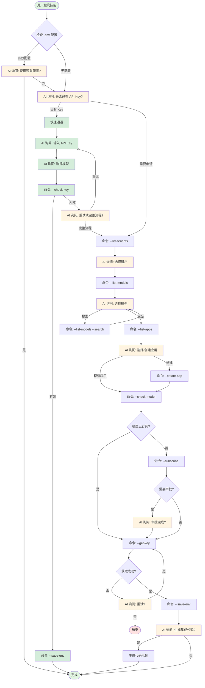

# LLM Gateway 接入 Skill

## 架构说明

本 Skill 采用 **命令式架构**：
- **脚本层** (`gateway_cli.py`)：提供原子化命令，每个命令完成一个独立操作，输出 JSON 格式结果
- **编排层** (本 SKILL.md)：通过调用命令 + `AskUserQuestion` 工具，灵活编排接入流程
- **向后兼容**：保留 `call_gateway.py --setup` 作为交互式完整流程

## AI 执行原则

1. **使用原子命令**：始终调用 `gateway_cli.py` 的具体命令，而非完整流程
2. **解析 JSON 输出**：命令返回 JSON 格式（stdout），提取 `data` 字段使用
   - **重要**: 命令的 JSON 输出在 stdout，emoji 日志在 stderr
   - 脚本解析时使用 `command 2>&1` 获取完整输出，或 `command 2>/dev/null` 只获取 JSON
3. **使用 AskUserQuestion**：在需要用户选择时，提供选项让用户决策
4. **灵活编排**：根据情况调整流程，支持中断和恢复
5. **保存上下文**：记录用户选择的租户、模型、应用等信息
6. **工作目录**：⚠️ **重要** - 在用户的项目目录中执行命令，`.env` 文件会保存在执行命令的当前目录
7. **环境变量名称**：🚨 **极其重要** - 写入 .env 文件时，**必须使用脚本中定义的标准变量名**：
   - `LX_LLM_GATEWAY_API_KEY` - API 密钥
   - `LX_LLM_GATEWAY_MODEL` - 模型 ID
   - `LX_LLM_GATEWAY_URL` - Gateway URL
   - `LX_LLM_GATEWAY_CONSUMER` - 应用名称
   - ⚠️ **不要使用其他变量名！不要自己创造变量名！**
   - ✅ **最佳做法**：使用 `--save-env` 命令，脚本会自动使用正确的变量名

8. **IDaaS 登录处理**：🚨 **极其重要** - 当命令触发 IDaaS 登录时，AI 必须主动处理
   - **检测登录**：命令输出包含"IDaaS 身份验证"或"登录链接"时，表示需要登录
   - **读取文件**：自动读取 `/tmp/llm_gateway_login.txt` 获取登录信息
   - **展示信息**：清晰地向用户展示登录链接和验证码（从文件中提取）
   - **等待完成**：命令会自动等待用户完成验证，验证完成后继续流程
   - ⚠️ **不要让用户手动操作**：AI 应该自动读取文件并展示，不要告诉用户运行 `cat` 命令


## 可用命令

**⚠️ 重要说明**:
- 下面示例中使用 `python3 scripts/gateway_cli.py` 假设您在 llm-gateway skill 目录中
- **如果您在自己的项目目录中**，请使用 skill 的绝对路径：
  ```bash
  # 假设 skill 在 ~/.claude/skills/llm-gateway/
  python3 ~/.claude/skills/llm-gateway/scripts/gateway_cli.py --list-tenants

  # 或设置环境变量简化调用
  export LLM_GATEWAY_SCRIPTS=~/.claude/skills/llm-gateway/scripts
  python3 $LLM_GATEWAY_SCRIPTS/gateway_cli.py --list-tenants
  ```
- `.env` 文件会保存在**您执行命令时的当前目录**（通常是您的项目目录）

### 查询类命令

```bash
# 列出租户
python3 scripts/gateway_cli.py --list-tenants

# 列出模型
python3 scripts/gateway_cli.py --list-models
python3 scripts/gateway_cli.py --list-models --search claude

# 列出应用
python3 scripts/gateway_cli.py --list-apps --tenant <tenant_id>

# 读取配置
python3 scripts/gateway_cli.py --read-env

# 验证 Key
python3 scripts/gateway_cli.py --check-key --key <api_key> --model <model_id>

# 查询订阅状态（包含已订阅的模型列表）
python3 scripts/gateway_cli.py --check-subscription --consumer <app_name> --tenant <tenant_id>

# 检查应用是否订阅了指定模型
python3 scripts/gateway_cli.py --check-model --consumer <app_name> --tenant <tenant_id> --model <model_id>

# 批量检查多个模型的订阅状态（高效）
python3 scripts/gateway_cli.py --batch-check-models \
  --consumer <app_name> \
  --tenant <tenant_id> \
  --models "model1,model2,model3"
```

### 操作类命令

```bash
# 创建应用
python3 scripts/gateway_cli.py --create-app --name <app_name> --tenant <tenant_id>

# 申请订阅
python3 scripts/gateway_cli.py --subscribe --consumer <app_name> --model <model_id> --tenant <tenant_id>

# 获取 API Key
python3 scripts/gateway_cli.py --get-key --consumer <app_name> --tenant <tenant_id>

# 保存配置
python3 scripts/gateway_cli.py --save-env --key <api_key> --model <model_id> --consumer <app_name>

# 更新配置（单个字段）
python3 scripts/gateway_cli.py --update-env --model <new_model>
python3 scripts/gateway_cli.py --update-env --consumer <new_consumer>
```

### 便捷命令

```bash
# 交互式完整流程（向后兼容）
python3 scripts/call_gateway.py --setup
```

## 标准接入流程

当用户请求接入模型时，按照以下步骤编排：

### 步骤 1: 检查现有配置

首先使用 `--read-env` 命令检查是否存在有效配置：

```python
# 1. 读取配置
result = 运行命令("python3 scripts/gateway_cli.py --read-env")
config_data = 解析JSON(result)["data"]

# 2. 判断配置是否存在且完整
if config_data["exists"] and config_data["complete"]:
    api_key = config_data["config"]["api_key"]
    model = config_data["config"]["model"]

    # 3. 验证 Key 有效性
    validation = 运行命令(
        f"python3 scripts/gateway_cli.py --check-key "
        f"--key {api_key} --model {model}"
    )
    is_valid = 解析JSON(validation)["data"]["valid"]

    if is_valid:
        使用 AskUserQuestion 询问: "检测到现有配置，是否继续使用？"
        if 用户选择继续:
            return "配置已就绪"
        else:
            继续新配置流程
    else:
        提示用户: "现有配置无效，需要重新配置"
        继续新配置流程
else:
    继续新配置流程
```

### 步骤 1.5: 询问是否已有 API Key（快速通道）

如果没有现有配置，在进入完整流程前，先询问用户是否已有 API Key：

```python
使用 AskUserQuestion 工具:
  question: "您是否已有 API Key？"
  options: [
    {label: "是，我已有 API Key（快速配置）", value: "has_key"},
    {label: "否，需要申请新的 Key", value: "need_new"}
  ]

if 用户选择 == "has_key":
    # 快速通道：直接输入 Key 和模型

    # 1. 询问 API Key
    使用 AskUserQuestion 工具（文本输入）:
      question: "请输入您的 API Key"
      # 用户输入 Key

    # 2. 询问模型 ID
    # 先获取推荐模型列表
    result = 运行命令("python3 scripts/gateway_cli.py --list-models")
    recommended = 解析JSON(result)["data"]["recommended"]

    使用 AskUserQuestion 工具:
      question: "请选择模型"
      options: [
        {label: model, value: model} for model in recommended
      ] + [
        {label: "手动输入模型 ID", value: "manual"}
      ]

    if 用户选择 == "manual":
        询问用户输入模型 ID

    # 3. 验证 Key 有效性
    result = 运行命令(
        f"python3 scripts/gateway_cli.py --check-key "
        f"--key {api_key} --model {model_id}"
    )
    data = 解析JSON(result)["data"]

    if not data.get("valid"):
        提示用户: "API Key 验证失败，请检查 Key 和模型 ID 是否正确"
        询问是否重试或进入完整流程
    else:
        # 4. 保存配置
        运行命令(
            f"python3 scripts/gateway_cli.py --save-env "
            f"--key {api_key} --model {model_id}"
        )
        return "配置完成（快速通道）"

# 如果用户选择 "need_new"，继续下面的完整流程
```

### 步骤 2: 选择租户

调用 `--list-tenants` 获取租户列表，智能选择租户：

```python
# 1. 调用命令获取租户
result = 运行命令("python3 scripts/gateway_cli.py --list-tenants")
tenants = 解析JSON(result)["data"]["tenants"]

# 2. 智能选择租户
if len(tenants) == 1:
    # 只有一个租户，自动选择
    selected_tenant_id = tenants[0]["tenantId"]
    tenant_name = tenants[0]["name"]
    提示用户: f"✅ 检测到唯一租户，已自动选择: {tenant_name}"
else:
    # 多个租户，让用户选择
    使用 AskUserQuestion 工具:
      question: "请选择租户"
      options: [
        {label: f"{tenant['name']} ({tenant['tenantId']})", value: tenant["tenantId"]} for tenant in tenants
      ]

    selected_tenant_id = 用户选择的值
```

### 步骤 3: 选择模型

调用 `--list-models` 获取模型列表：

```python
# 1. 获取推荐模型
result = 运行命令("python3 scripts/gateway_cli.py --list-models")
data = 解析JSON(result)["data"]
recommended = data["recommended"]

# 2. 使用 AskUserQuestion 让用户选择
使用 AskUserQuestion 工具:
  question: "请选择模型"
  options: [
    {label: model, value: model} for model in recommended[:7]
  ] + [
    {label: "搜索其他模型", value: "search"}
  ]

# 3. 如果用户选择搜索
if 用户选择 == "search":
    询问搜索关键词
    result = 运行命令(f"python3 scripts/gateway_cli.py --list-models --search {keyword}")
    # 再次让用户选择

selected_model = 用户选择的值
```

### 步骤 4: 选择或创建应用

调用 `--list-apps` 获取现有应用：

```python
# 1. 获取现有应用
result = 运行命令(f"python3 scripts/gateway_cli.py --list-apps --tenant {tenant_id}")
apps = 解析JSON(result)["data"]["apps"]

# 2. 使用 AskUserQuestion 让用户选择
options = [
    {label: app['appName'], value: app["appName"]} for app in apps
] + [
    {label: "创建新应用（自动生成名称）", value: "create_auto"},
    {label: "创建新应用（自定义名称）", value: "create_custom"}
]

使用 AskUserQuestion 工具:
  question: "请选择应用"
  options: options

# 3. 处理选择
if 用户选择 == "create_auto":
    app_name = f"{username}-llm-{timestamp}"
    运行命令(f"python3 scripts/gateway_cli.py --create-app --name {app_name} --tenant {tenant_id}")
elif 用户选择 == "create_custom":
    询问自定义名称
    运行命令(f"python3 scripts/gateway_cli.py --create-app --name {custom_name} --tenant {tenant_id}")
else:
    app_name = 用户选择的值

selected_app = app_name
```

### 步骤 5: 检查并申请订阅

**重要**: 在申请订阅前，先检查应用是否已订阅该模型，避免重复申请。

```python
# 1. 检查模型是否已订阅
check_result = 运行命令(
    f"python3 scripts/gateway_cli.py --check-model "
    f"--consumer {app_name} --model {model_id} --tenant {tenant_id}"
)
check_data = 解析JSON(check_result)["data"]

if check_data.get("subscribed"):
    提示用户: f"应用 {app_name} 已订阅模型 {model_id}，可直接使用"
    跳过订阅申请，直接进入步骤 6
else:
    提示用户: f"应用 {app_name} 未订阅模型 {model_id}"
    if check_data.get("all_models"):
        提示用户: f"当前已订阅的模型: {', '.join(check_data['all_models'])}"

    # 2. 申请订阅
    result = 运行命令(
        f"python3 scripts/gateway_cli.py --subscribe "
        f"--consumer {app_name} --model {model_id} --tenant {tenant_id}"
    )
    data = 解析JSON(result)["data"]

    # 3. 如果需要审批
    if data.get("approval_required"):
        提示用户: "订阅申请已提交，请前往飞书完成审批"

        使用 AskUserQuestion 询问:
            question: "请前往飞书审批，完成后选择下一步操作"
            options: [
                {label: "已完成审批，继续配置", description: "审批已通过，现在获取 API Key 并完成配置", value: "approved"},
                {label: "稍后再配置", description: "暂时跳过，等审批通过后再手动配置", value: "later"}
            ]

        if 用户选择 == "later":
            提示用户: "配置已暂停，审批通过后请重新运行配置流程"
            return None, None
        # 如果选择 "approved"，继续执行获取 API Key
```

### 步骤 6: 获取 API Key

```python
# 1. 获取 Key
result = 运行命令(
    f"python3 scripts/gateway_cli.py --get-key "
    f"--consumer {app_name} --tenant {tenant_id}"
)
data = 解析JSON(result)["data"]

# 2. 如果获取失败，提供重试选项
if not data.get("success"):
    使用 AskUserQuestion 询问: "未获取到 Key，可能需要等待审批。是否重试？"
```

### 步骤 7: 保存配置

```python
# 🚨 重要：使用 --save-env 命令，会自动使用正确的变量名
# 脚本会写入以下变量（不要手动创建其他变量名）：
#   LX_LLM_GATEWAY_API_KEY
#   LX_LLM_GATEWAY_MODEL
#   LX_LLM_GATEWAY_URL
#   LX_LLM_GATEWAY_CONSUMER

# 保存到 .env（会保存在当前工作目录）
运行命令(
    f"python3 scripts/gateway_cli.py --save-env "
    f"--key {api_key} --model {model_id} --consumer {app_name}"
)

# 获取保存路径并告知用户
env_path = os.path.abspath(".env")
提示用户: f"配置已保存到 {env_path}"
提示用户: "变量名: LX_LLM_GATEWAY_API_KEY, LX_LLM_GATEWAY_MODEL, LX_LLM_GATEWAY_URL, LX_LLM_GATEWAY_CONSUMER"
提示用户: "请确保将 .env 添加到 .gitignore，避免泄露密钥"
```

### 步骤 8: 生成集成代码（可选）

使用 `AskUserQuestion` 询问用户是否需要生成集成代码：

```python
使用 AskUserQuestion 工具:
  question: "是否生成集成代码示例？"
  options: [
    {label: "是，生成代码", value: "yes"},
    {label: "否，稍后自己集成", value: "no"}
  ]

if 用户选择 == "yes":
    # 复制模板文件
    复制文件("templates/llm_client.py", "llm_client.py")

    # 展示示例代码
    显示示例代码:
        from llm_client import chat_completion

        response = chat_completion([
            {"role": "user", "content": "Hello!"}
        ])
        print(response)
```

## 特殊场景处理

### 仅查看模型列表

如果用户只是询问"有哪些模型可用"，直接运行：

```bash
python3 scripts/gateway_cli.py --list-models
```

解析并展示 JSON 结果中的推荐模型列表。

### 快速配置（已有 Key）

**场景**: 用户已有 API Key

**流程**:

1. AI 询问："您是否已有 API Key？"
   - 用户选择："是，我已有 API Key"

2. AI 询问："请输入您的 API Key"（文本输入）
   - 用户输入完整的 Key

3. AI 获取推荐模型列表，询问："请选择模型"
   - 显示推荐模型选项
   - 提供"手动输入模型 ID"选项

4. AI 验证 Key 和模型：
   ```bash
   python3 scripts/gateway_cli.py --check-key --key <KEY> --model <MODEL>
   ```

5. 如果验证成功，保存配置：
   ```bash
   python3 scripts/gateway_cli.py --save-env --key <KEY> --model <MODEL>
   ```

6. 如果验证失败：
   - 询问用户："验证失败，是否重新输入或进入完整申请流程？"

**优势**: 跳过租户选择、应用创建、订阅申请等步骤，最快 3 步完成配置

### 更换模型

**场景**: 用户已有配置，只想更换模型

**流程**:

1. 读取现有配置：
   ```bash
   python3 scripts/gateway_cli.py --read-env
   ```

2. AI 显示当前模型，询问新模型：
   ```python
   current_model = config["model"]
   提示用户: f"当前模型: {current_model}"

   # 获取推荐模型
   models = 运行命令("python3 scripts/gateway_cli.py --list-models")
   recommended = 解析JSON(models)["data"]["recommended"]

   使用 AskUserQuestion: "请选择新模型"
   ```

3. 更新配置（只更新模型）：
   ```bash
   python3 scripts/gateway_cli.py --update-env --model <new_model>
   ```

4. 检查模型订阅状态：
   ```python
   # 检查是否已订阅新模型
   consumer = config["consumer"]
   tenant_id = # 从配置或租户列表获取

   # 使用 --check-model 命令检查特定模型
   check_result = 运行命令(
       f"python3 scripts/gateway_cli.py --check-model "
       f"--consumer {consumer} --tenant {tenant_id} --model {new_model}"
   )
   check_data = 解析JSON(check_result)["data"]

   if not check_data.get("subscribed"):
       提示用户: f"需要申请订阅新模型 {new_model}"
       if check_data.get("all_models"):
           提示用户: f"当前已订阅: {', '.join(check_data['all_models'])}"

       # 执行订阅流程
       运行命令(
           f"python3 scripts/gateway_cli.py --subscribe "
           f"--consumer {consumer} --tenant {tenant_id} --model {new_model}"
       )
   else:
       提示用户: f"模型 {new_model} 已订阅，可直接使用"
   ```

**优势**:
- 不需要重新输入 Key
- 不需要重新选择租户和应用
- 只需 3 步完成模型切换

## 模型订阅检查功能

### 概述

系统支持**模型级别的订阅检查**，可以：
1. 查询应用已订阅的所有模型
2. 检查应用是否订阅了特定模型
3. 智能避免重复订阅申请

### 核心命令

#### 1. 查询应用的所有订阅模型

```bash
python3 scripts/gateway_cli.py --check-subscription \
  --consumer <app_name> \
  --tenant <tenant_id>
```

**返回示例**:
```json
{
  "success": true,
  "data": {
    "subscribed": true,
    "subscription": {
      "id": 5393,
      "consumer": "my-app",
      "tenant_id": "wlxlvn",
      "status": "active",
      "subscribed_models": [
        "azure-gpt-5_2",
        "aws-claude-sonnet-4-5",
        "gemini-3-pro-preview"
      ],
      "model_count": 3
    }
  }
}
```

#### 2. 检查应用是否订阅了特定模型

```bash
python3 scripts/gateway_cli.py --check-model \
  --consumer <app_name> \
  --tenant <tenant_id> \
  --model <model_id>
```

**返回示例（已订阅）**:
```json
{
  "success": true,
  "data": {
    "subscribed": true,
    "model": "aws-claude-sonnet-4-5",
    "consumer": "my-app",
    "consumer_id": 5393,
    "message": "应用 'my-app' 已订阅模型 'aws-claude-sonnet-4-5'"
  }
}
```

**返回示例（未订阅）**:
```json
{
  "success": true,
  "data": {
    "subscribed": false,
    "model": "gemini-3-flash-preview",
    "consumer": "my-app",
    "consumer_id": 5393,
    "all_models": [
      "azure-gpt-5_2",
      "aws-claude-sonnet-4-5"
    ],
    "message": "应用 'my-app' 未订阅模型 'gemini-3-flash-preview'。已订阅的模型: azure-gpt-5_2, aws-claude-sonnet-4-5"
  }
}
```

### 智能订阅流程

在申请订阅前，**必须先检查模型是否已订阅**：

```python
# 步骤 1: 检查模型订阅状态
check_result = 运行命令(
    f"python3 scripts/gateway_cli.py --check-model "
    f"--consumer {app_name} --model {model_id} --tenant {tenant_id}"
)
check_data = 解析JSON(check_result)["data"]

# 步骤 2: 根据检查结果决定操作
if check_data.get("subscribed"):
    # 模型已订阅，直接使用
    提示用户: f"✅ 模型 {model_id} 已订阅，可直接使用"
    跳过订阅申请，直接获取 API Key
else:
    # 模型未订阅，需要申请
    提示用户: f"⚠️  模型 {model_id} 未订阅"

    if check_data.get("all_models"):
        提示用户: f"当前已订阅的模型: {', '.join(check_data['all_models'])}"

    使用 AskUserQuestion 询问: "是否申请订阅该模型？"

    if 用户确认:
        # 申请订阅
        运行命令(
            f"python3 scripts/gateway_cli.py --subscribe "
            f"--consumer {app_name} --model {model_id} --tenant {tenant_id}"
        )
```

### 使用场景

#### 场景 1: 避免重复订阅

**问题**: 用户多次运行配置流程，导致重复申请同一模型的订阅。

**解决**: 在步骤 5（申请订阅）前，先使用 `--check-model` 检查：

```python
check_result = 运行命令(f"... --check-model ...")
if 解析JSON(check_result)["data"]["subscribed"]:
    跳过订阅申请
```

#### 场景 2: 模型切换检查

**问题**: 用户更换模型时，不确定是否已订阅新模型。

**解决**: 在更新配置前检查：

```python
check_result = 运行命令(
    f"python3 scripts/gateway_cli.py --check-model "
    f"--consumer {app_name} --model {new_model} --tenant {tenant_id}"
)

if not 解析JSON(check_result)["data"]["subscribed"]:
    提示用户: "需要申请订阅新模型"
    # 执行订阅流程
```

#### 场景 3: 订阅状态诊断

**问题**: 用户 API 调用失败，不清楚是 Key 问题还是模型未订阅。

**解决**: 分步检查：

```python
# 1. 检查 Key 有效性
key_check = 运行命令(f"... --check-key ...")

# 2. 检查模型订阅
model_check = 运行命令(f"... --check-model ...")

# 3. 提供精确的诊断信息
if not key_valid:
    提示: "API Key 无效"
elif not model_subscribed:
    提示: "模型未订阅"
else:
    提示: "配置正常，可能是其他问题"
```

### 最佳实践

1. **总是先检查再申请**: 在调用 `--subscribe` 前，先调用 `--check-model`
2. **向用户展示订阅状态**: 让用户知道哪些模型已订阅，哪些需要新申请
3. **处理已订阅情况**: 如果模型已订阅，跳过订阅申请，直接进入下一步
4. **提供订阅列表**: 当模型未订阅时，显示当前已订阅的模型列表供参考

## 高级主题

### 性能优化

#### 批量模型检查

当需要检查多个模型的订阅状态时，使用批量检查可大幅提升性能:

**场景**: 检查3个以上的模型

**低效方式** (每个模型2次API调用):
```bash
# 检查3个模型 = 6次API调用
python3 scripts/gateway_cli.py --check-model ... --model model1
python3 scripts/gateway_cli.py --check-model ... --model model2
python3 scripts/gateway_cli.py --check-model ... --model model3
```

**高效方式** (只需2次API调用):
```bash
# 一次性检查3个模型 = 2次API调用 (性能提升3倍)
python3 scripts/gateway_cli.py --batch-check-models \
  --consumer my-app \
  --tenant wlxlvn \
  --models "model1,model2,model3"
```

**返回格式**:
```json
{
  "success": true,
  "data": {
    "checked_models": {
      "model1": {"subscribed": true},
      "model2": {"subscribed": false},
      "model3": {"subscribed": true}
    },
    "summary": {
      "total": 3,
      "subscribed": 2,
      "not_subscribed": 1
    },
    "all_subscribed_models": ["model1", "model3", "azure-gpt-5", ...]
  }
}
```

**使用场景**:
- 项目启动前检查所有需要的模型
- 批量订阅前的预检查
- 应用迁移时验证订阅状态
- CI/CD管道中的自动化检查

**最佳实践**:
- 检查1-2个模型: 使用 `--check-model`
- 检查3+个模型: 使用 `--batch-check-models` (推荐)
- 自动化脚本: 优先使用批量检查

详细文档参见: [BATCH_CHECK_GUIDE.md](BATCH_CHECK_GUIDE.md)

#### 订阅缓存机制

系统内置5分钟订阅缓存，避免在同一流程中重复查询:

- **适用场景**: 单次执行中多次检查订阅状态
- **生效范围**: 同一进程/工作流内有效
- **限制**: 不同CLI调用之间缓存不共享

**示例**:
```python
# 在同一流程中，第二次检查会使用缓存(无API调用)
check_result_1 = 运行("--check-model ... --model model1")  # API调用
check_result_2 = 运行("--check-model ... --model model2")  # 使用缓存，无API调用
```

### 多租户场景

#### 跨租户模型切换

当需要在不同租户之间切换时:

```python
# 1. 读取当前配置
config = 运行("--read-env")
current_tenant = config["tenant_id"]  # 假设保存了租户信息

# 2. 询问用户选择新租户
tenants = 运行("--list-tenants")
使用 AskUserQuestion: "切换到哪个租户?"

# 3. 检查新租户中的应用和订阅
apps = 运行(f"--list-apps --tenant {new_tenant}")
# ... 继续流程
```

#### 多应用管理

为同一租户下的多个应用配置不同模型:

```python
# 应用A: 使用 GPT-5
运行("--save-env --key {key_a} --model azure-gpt-5 --consumer app-a")

# 应用B: 使用 Claude
运行("--save-env --key {key_b} --model aws-claude-4 --consumer app-b")
```

### 自动化集成

#### CI/CD管道集成

```bash
#!/bin/bash
# 在CI/CD中验证模型配置

REQUIRED_MODELS="azure-gpt-5,aws-claude-4,gemini-3-pro"

# 批量检查所有必需模型
result=$(python3 scripts/gateway_cli.py --batch-check-models \
  --consumer "$CI_APP_NAME" \
  --tenant "$CI_TENANT_ID" \
  --models "$REQUIRED_MODELS" 2>/dev/null)

# 检查是否全部订阅
not_subscribed=$(echo "$result" | jq -r '.data.summary.not_subscribed')

if [ "$not_subscribed" -gt 0 ]; then
    echo "❌ 有模型未订阅，部署失败"
    echo "$result" | jq -r '.data.checked_models | to_entries[] | select(.value.subscribed == false) | "  - \(.key)"'
    exit 1
fi

echo "✅ 所有模型已订阅，继续部署"
```

#### 批量订阅脚本

```bash
#!/bin/bash
# 为新应用批量订阅模型

CONSUMER="new-app"
TENANT="wlxlvn"
MODELS=("azure-gpt-5" "aws-claude-4" "gemini-3-pro")

# 1. 批量检查哪些未订阅
check_result=$(python3 scripts/gateway_cli.py --batch-check-models \
  --consumer "$CONSUMER" \
  --tenant "$TENANT" \
  --models "$(IFS=,; echo "${MODELS[*]}")" 2>/dev/null)

# 2. 提取未订阅的模型
unsubscribed=$(echo "$check_result" | jq -r '.data.checked_models | to_entries[] | select(.value.subscribed == false) | .key')

# 3. 只为未订阅的模型申请订阅
for model in $unsubscribed; do
    echo "申请订阅: $model"
    python3 scripts/gateway_cli.py --subscribe \
      --consumer "$CONSUMER" \
      --tenant "$TENANT" \
      --model "$model"
done
```

### 故障排查

#### 常见错误诊断流程

当用户报告"API调用失败"时，按以下步骤诊断:

```python
# 1. 检查配置文件
config = 运行("--read-env")
if not config["data"]["exists"]:
    提示: "配置文件不存在，请运行配置流程"
    return

# 2. 验证API Key
key_check = 运行(f"--check-key --key {api_key} --model {model}")
if not key_check["data"]["valid"]:
    提示: "API Key无效或已过期，请重新获取"
    return

# 3. 检查模型订阅
model_check = 运行(f"--check-model --consumer {consumer} --tenant {tenant} --model {model}")
if not model_check["data"]["subscribed"]:
    提示: "模型未订阅，请先申请订阅"
    return

提示: "配置正常，可能是网络或服务端问题"
```

#### 订阅状态不一致

如果订阅检查结果与实际不符:

1. **清除缓存**: 重启CLI进程(缓存5分钟TTL)
2. **重新查询**: 使用 `--check-subscription` 获取最新状态
3. **联系管理员**: 可能是后台审批状态变更

### 安全最佳实践

1. **API Key保护**:
   - 不要将 `.env` 文件提交到版本控制
   - 添加 `.env` 到 `.gitignore`
   - 使用环境变量或密钥管理系统

2. **权限最小化**:
   - 只订阅实际需要的模型
   - 定期检查和清理不使用的订阅

3. **审计日志**:
   - 记录所有订阅申请和Key获取操作
   - 定期审查应用的订阅列表

## 流程图



**流程图说明**:
- **CheckModel节点**: 在申请订阅前检查模型是否已订阅，避免重复申请
- **批量检查**: 流程图展示单个模型检查流程，批量检查(`--batch-check-models`)用于需要同时检查多个模型的场景
- **性能优化**: 批量检查3个以上模型时，使用`--batch-check-models`可将性能提升3-10倍

## 错误处理

所有命令输出 JSON 格式，包含 `success` 字段：

```json
{
  "success": true,
  "data": { ... }
}
```

或

```json
{
  "success": false,
  "error": "错误信息"
}
```

AI 应检查 `success` 字段，如果为 `false`，向用户展示错误信息并提供：
- 重试选项
- 跳过选项
- 返回上一步选项

## 常见问题

**Q: 命令执行失败怎么办？**
A: 检查 JSON 输出的 `error` 字段，向用户展示具体错误，提供重试或跳过选项。

**Q: 用户中途想换选择怎么办？**
A: 命令式架构支持随时重新执行某个步骤，无需从头开始。

**Q: 如何支持批量配置？**
A: 可以通过循环调用命令，为多个模型或应用批量配置。

**Q: 向后兼容如何处理？**
A: 保留 `call_gateway.py --setup`，用户可以选择使用交互式完整流程。
